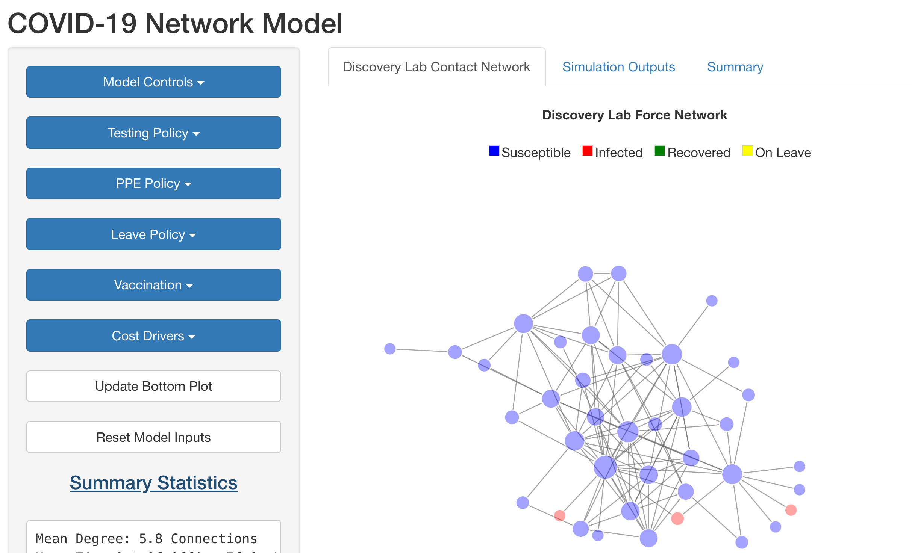
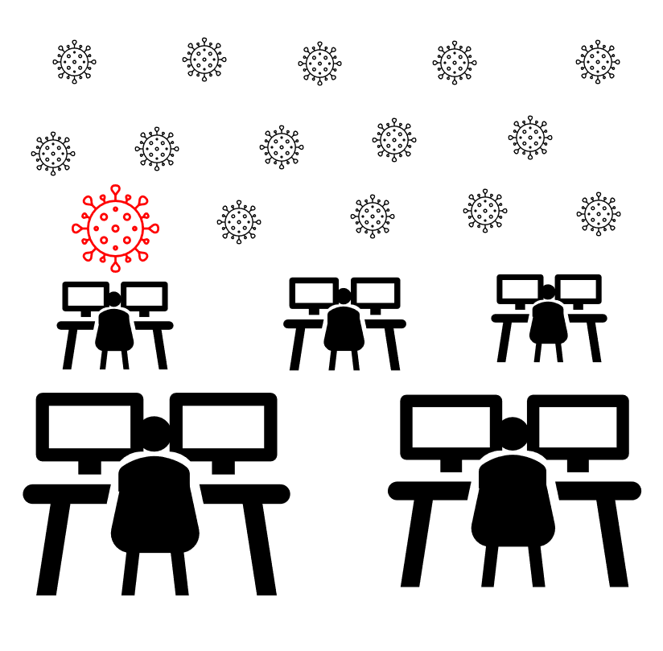
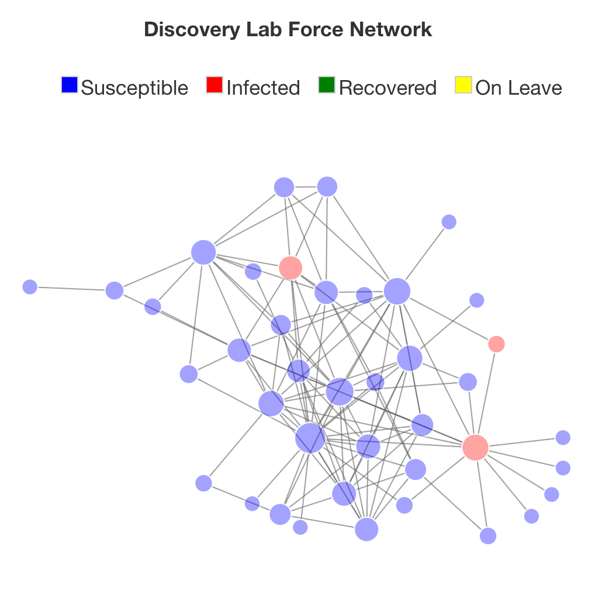

## Introduction


<aside class="notes">
In the United States, local decision makers, from school board members to office managers, are being asked to make life and death decisions about when and how to re-open their buildings. Pressure to reopen schools and offices will grow as more and more of the population is vaccinated and these leaders need to be able to make informed decisions.
</aside>
## The system is complex


>- Processes are non-linear
>- Policies outside your institution impact outcomes in your institution
>- Systems within your institution interact in unexpected ways

<aside class="notes">
These individuals are being asked to reason about a system 
</aside>


## Problem Statement

Assessing risk of SARS-COV-2 infection in indoor spaces is complicated because interactions at multiple spatial and temporal scales influence fine scale disease transmission.


## Graphical User Interface



<aside class="notes">
To make it easier for decision makers to reason about the system, we developed a graphical user interface that allows them to run different scenarios and see the impacts of their choices. 
</aside>

## Simulation Framework

We developed extensible simulation engine accepts modules that modify transmission dynamics. 

```{r echo=FALSE}
DiagrammeR::grViz("
  digraph graph2 {
  
  graph [layout = dot, rankdir = LR]
  
  # node definitions with substituted label text
  node [shape = Square,
        style = filled,
        fixedsize = true,
        width = 1.3]
        
  a [label = 'Graph Object', 
     fillcolor = LightBlue]
  b [label = Model,
     fillcolor = SpringGreen]
  c [label = 'Module 1',
     fillcolor = PaleGoldenrod]
  d [label = 'Module N',
     fillcolor = Plum]
  e [label = 'Simulation\nEngine']
  
  f [label = 'Parameters', 
     fillcolor = Linen]
  
  a->e b->e {c d}->b f->c
  
  }
  ", 
  height = 300)
```


## Extended SIR Model

```{r echo=FALSE}
DiagrammeR::grViz("
  digraph graph2 {
  
  graph [layout = dot, rankdir = LR]
  
  # node definitions with substituted label text
  node [shape = circle,
        style = filled,
        fixedsize = true,
        width = 0.95]
        
  a [label = Susceptible, 
     fillcolor = PaleGreen]
  b [label = Infected,
     fillcolor = Thistle]
  c [label = Removed,
     fillcolor = Gold]
  d [label = Leave,
     shape = s,
     fillcolor = Orange]
  
  node [shape = s,
        style = filled,
        fixedsize = true,
        width = 1.5]   
  
  e [label = 'Direct\nContact',
     fillcolor = LightBlue]
  f [label = 'Environmental\nExposure',
     fillcolor = LightCyan]
  g [label = 'External',
     fillcolor = HoneyDew]

  b->c b->d d->c
  {e f g} -> b
  
  edge [arrowhead = none ]
  a-> {e g f}
    
  
  
  }
  ", 
  height = 300)
```


## Infectiousness Profile

```{r echo=FALSE}
library(ggplot2)

infFuncToy <- function(x){
  a <- dgamma(x,shape = 6)
  b <- a/max(a)
}

p <- ggplot(data = data.frame(x = 0), mapping = aes(x = x))

p + 
  stat_function(fun = infFuncToy,size = 2, color = "black")+ 
  xlim(0,20) +
  theme_bw( base_size = 18) +
  xlab("Days Post Infection") +
  ylab("Relative Infectiousness")
  

```

<aside class="notes">

Because we know individuals are not immediately infectious and the amount of virus shed wanes after 5 days post infection, we have generated a relative infectiousness profile. This allows to better reflect the reality of covid transmission. Something that may realize when looking at this plot, is that when you test and remove newly infectious individuals, you are sparing the larger population from being exposed to a highly infectious individual. 

Based work by Larremore et al regarding viral load.
https://www.medrxiv.org/content/10.1101/2020.06.22.20136309v3.full.pdf+html
</aside>

## How does transmission happen in our Model?


1) External Transmission
2) Environmental Transmission
3) Direct Contact Transmission


## Estimating external infections

[get explanation/figure from trevor]

- Probability of infection estimated from a micro mcmc model - work was presented early today by Trevor Kent and Heather Pastolic.

- Uses case counts back estimated from deaths and mobility data derived from cell phone data to determine the probability of infection in a given location. 

- We use that probability of infection to generate external infections while simulants are outside of their office space.   


## Estimating Environmental infections


<style>
.container{
    display: flex;
}
.col{
    flex: 1;
}
</style>


<div class="container">

<div class="col">
  
</div>
<div class="colstyle="text-align=left;">
### *Risk of Infection* 
- *Emission Rate*
- *Viral Concentration in Room*
- *Inhalataion Rate*
- Time divided into 15 minute segments

  <small> 
    [G. Buonanno et al. 2020](https://doi.org/10.1016/j.envint.2020.106112)
  </small>
</div>
</div>

<aside class="notes">
  Weills Reily Model 
  CIRES group at University of Colorado Boulder
</aside>  

## Estimating direct contact infections

<style>
.container{
    display: flex;
}
.col{
    flex: 1;
}
</style>


<div class="container">

<div class="col">

```{r echo=FALSE}
DiagrammeR::grViz("
  digraph graph2 {
  
  graph [layout = neato]
  
  # node definitions with substituted label text
  node [shape = circle,
        style = filled,
        fixedsize = true,
        width = 0.95]
        
  a [label = Susceptible, 
     fillcolor = PaleGreen]
  b [label = Infected,
     fillcolor = Thistle]
  c [label = Infected,
     fillcolor = Thistle]
  d [label = Infected,
     fillcolor = Thistle]   
  e [label = Removed,
     fillcolor = Gold]
  f [label = Leave,
     shape = egg,
     fillcolor = Orange]

  edge [arrowhead = none ]
  b->a c->a d->a e->a f->a
    
  }
  ", height = 400, width = 400)
```
</div>
<div class="col" style="text-align=left;">

$$ R_{j}=\sum\limits_{i=1}^nI_{i}\delta_iP_{dc}  $$
$I_{i}$ = relative infectiousness of adjacent infected nodes  
$\delta_i$ = transmission modifiers 
$P_{dc}$ = probability of infection given direct contact  


</div>
</div>


## How is transmission prevented? 

## Hazard Control Modules


*Image produced by University of California Davis*


## Hazard Control modules

- **Leave Policy** - removes individuals who tested positive for a number of time steps
- **Room Density Limits** - reduces number of people in a room 
- **Personal Protective Equipment** - reduces the probability of acquiring infection
- **Testing** - does not directly impact transmission but may inform other policies (e.g. leave)


## Vaccination

- Protects from severe disease
- May not prevent transmission


## Data Collection

<style>
.container{
    display: flex;
}
.col{
    flex: 1;
}
</style>


<div class="container">

<div class="col">


</div>
<div class="col">
- Surveyed lab mates asking them to indentify contacts (n=46)
- Took mean of reported contact strength  
- Estimated room volumes
- Other values derived from literature
</div>
</div>
## Model Initial Conditions

- Three random infections
- Testing occurs every three days, 50% of population is tested and receives results within two days.
- 95% of people using full PPE suite (surgical mask, eye protection, distancing)
- Density limit of $\frac{1\,person}{12\,m^3}$
- 100 simulation runs, 60 time steps each
- Other parameters determined by exhaustive lit review (see table in appendix)

## Results

- Modifying testing frequency and leave policy have greatest impact on transmission, even when testing a fraction of the population
- Increasing air exchange rates and decreasing room density also has a large impact on transmission
- Under base conditions, direct contact and environmental transmission are the primary drivers modes of transmission

## Conclusions

## Appendix

## SARS-COV-2 Transmission

- Presence of infectious individuals or materials
- Inhalation of infectious particles 
- Introduction of fomites to mucus membranes

<aside class="notes>

</aside>

## Model layers


- External Transmission
- Environmental Transmission
- Direct Contact Transmission
- Transmission Modifiers


##  Environmental Infections Equations

- *Emission Rate*
$$ {ER_{q,j} = c_v*c_i*IR*\sum_{i=1}^4(N_{i,j}*V_i)} $$

- *Viral Concentration in Room*
$$ {n(t) = \frac{ER_q*I}{IVRR*V}+(n_o+\frac{ER_q*I}{IVRR})*\frac{e^{IVRR*t}}{V}} $$

- *Risk of Infection*
$$ {R_{env} = 1-e^{-IR\int_0^Tn(t)dt}} $$

  <small> 
    [G. Buonanno et al. 2020](https://doi.org/10.1016/j.envint.2020.106112)
  </small>

<aside class="notes">
  Weills Reily Model 
  CIRES group at University of Colorado Boulder
</aside>  

